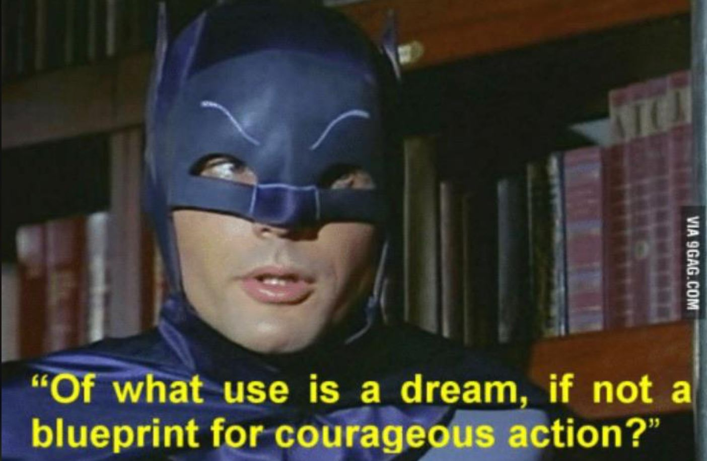

# BatVision
Deobfuscate .bat/.cmd files which have been obfuscated by BatCloak.


## First, what is BatCloak?
BatCloak is a tool which obfuscates .bat/.cmd files into something that looks like this:


BatVision.ps1 will remove the extraneous characters and create a new file which looks something like this:


## Instructions:

1. Download BatVision.ps1.
2. Place obfuscated .bat/.cmd file in the same location.
3. Open PowerShell in that location.
4. Use BatVision.ps1 to deobfuscate the .bat/.cmd file.
5. Continue fighting crime.

## Usage
### Deobfuscate .bat/.cmd file
```
PS > BatVision.ps1 [file.cmd]
```

## Output
BatVision.ps1 will create a new deobfuscated file in the same location as the original file. It will have the word '_deobfuscated' added to the file name.
Note: The BATCOMPUTER (i.e., Claude AI) helped to create this script and in its wisdom decided to create all of this fancy ouput. 


## Warning
Deobfuscators such as this are very brittle in that all the attacker has to do is change things up on his end and BatVision.ps1 will not work any more. But until then, happy hunting!

## Finally...


