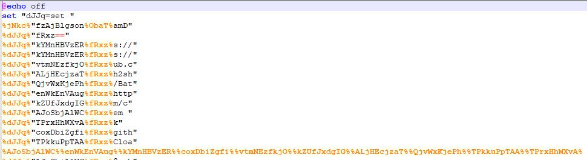

# BatVision
Deobfuscate .bat/.cmd files which have been obfuscated by BatCloak.


## What is BatCloak?
BatCloak is a tool which obfuscates .bat/.cmd files into something that looks like this:


BatVision.ps1 will remove the extraneous characters into something like this:


## Instructions:

1. Download BatVision.ps1.
2. Place obfuscated .bat/.cmd file in the same location.
3. Open PowerShell in that location.
4. Use BatVision.ps1 to deobfuscate the .bat/.cmd file.

## Usage
### Deobfuscate .bat/.cmd file
```
PS > BatVision.ps1 file.cmd
```

## Output
BatVision.ps1 will create a new deobfuscated file in the same location as the original file. It will have the '_deobfuscated' added to the file name.

